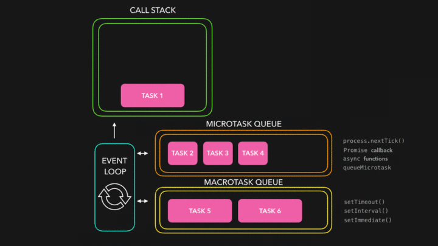

# JavaScript

<details>
<summary>typeof 与 instanceof</summary>

> `typeof` 和 `instanceof` 常用来判断一个变量类型

typeof 一般只能返回如下几个结果:

- number
- string
- boolean
- object
- function
- undefined

> `instanceof` 运算符判断是否属于某个构造的实例

#### 参考

- [JS 中 typeof 与 instanceof 的区别](https://www.cnblogs.com/Trr-984688199/p/6180040.html)
- [JavaScript 专题之类型判断(上)](https://github.com/mqyqingfeng/Blog/issues/28)
- [JavaScript 专题之类型判断(下)](https://github.com/mqyqingfeng/Blog/issues/30)

</details>

<details>
<summary>如何判断一个变量是对象还是数组</summary>

- typeof + length

由于 `typeof` 都返回 `object`，因此需要加上 `length` 属性判断

```js
(o) => {
  if (typeof o === "object") {
    if (typeof o.length === "number") {
      return "Array";
    } else {
      return "Object";
    }
  }
};
```

- instanceof

```js
var obj = {};
var arr = [];

obj instanceof Object;
arr instanceof Array;
```

由于数组也是 `Object`，因此在判断的时候，需要先判断是否为 Array，然后才是 Object

```js
(o) => {
  if (o instanceof Array) {
    return "Array";
  } else if (o instanceof Object) {
    return "Object";
  }
};
```

- constructor

```js
(o) => {
  if (o.constructor === Array) {
    return "Array";
  } else if (o.constructor === Object) {
    return "Object";
  }
};
```

- toString()

数组原型和对象原型定义的 toString()方法不同

```js
(o) => {
  if (Object.prototype.toString.call(o) === "[object Array]") {
    return "Array";
  } else if (Object.prototype.toString.call(o) === "[object Object]") {
    return "Object";
  }
};
```

- Array.isArray()

```js
(o) => {
  if (Array.isArray(o)) {
    return "Array";
  }
  return "Object";
};
```

#### 参考

- [JS 中 typeof 与 instanceof 的区别](https://www.cnblogs.com/Trr-984688199/p/6180040.html)
- [判断一个变量类型是数组还是对象](https://www.cnblogs.com/Walker-lyl/p/5597547.html)

</details>

<details>
<summary>常用的 Javascript 设计模式</summary>

> 设计模式：一套被反复使用、经过分类编目的、代码设计经验的总结

- 单体模式
- 工厂模式
- 单例模式
- 观察者模式（发布订阅模式）
- 策略模式
- 模板模式
- 代理模式
- 外观模式

#### 单体模式（不是单例）

> 只能被实例化一次，将一批相关的属性和方法组织在一起的对象

```js
const Singleton = {
  attribute: true,
  method1: () => {},
  method2: () => {},
};
```

#### 工厂模式

> 提供创建对象的接口，意思就是根据领导（调用者）的指示（参数），生产相应的产品（对象）

- `简单工厂模式`：使用一个类，通常为单体，来生成实例。
- `复杂工厂模式`：将其成员对象的实列化推到子类中，子类可以重写父类接口方法以便创建的时候指定自己的对象类型

```js
// 简单工厂模式
const XMLHttpFactory = function() {};

XMLHttpFactory.createXMLHttp = function() {
  let XMLHttp = null;
  if (window.XMLHttpRequest) {
    XMLHttp = new XMLHttpRequest();
  } else if (window.ActiveXObject) {
    XMLHttp = new ActiveXObject("Microsoft.XMLHTTP");
  }
  return XMLHttp;
};

// XMLHttpFactory.createXMLHttp()这个方法根据当前环境的具体情况返回一个XHR对象。
const AjaxHander = function() {
  const XMLHttp = XMLHttpFactory.createXMLHttp();
};
```

```js
// 复杂工厂模式
const XMLHttpFactory = function() {};

XMLHttpFactory.prototype = {
  // 如果真的要调用这个方法会抛出一个错误，它不能被实例化，只能用来派生子类
  createFactory: function() {
    throw new Error("我是一个抽象方法，不能直接调用");
  },
};

const XHRHandler = function() {}; // 定义一个子类

// 子类继承父类原型方法
extend(XHRHandler, XMLHttpFactory);

XHRHandler.prototype = new XMLHttpFactory(); // 把超类原型引用传递给子类,实现继承
XHRHandler.prototype.constructor = XHRHandler; // 重置子类原型的构造器为子类自身

//重新定义createFactory 方法
XHRHandler.prototype.createFactory = function() {
  var XMLHttp = null;
  if (window.XMLHttpRequest) {
    XMLHttp = new XMLHttpRequest();
  } else if (window.ActiveXObject) {
    XMLHttp = new ActiveXObject("Microsoft.XMLHTTP");
  }
  return XMLHttp;
};
```

#### 单例模式

> 单例模式定义了一个对象的创建过程，此对象只有一个单独的实例

```js
var single = (function() {
  var instance;

  function getInstance() {
    // 如果该实例存在，则直接返回，否则就对其实例化
    if (instance === undefined) {
      instance = new Constructor();
    }
    return instance;
  }

  function Constructor() {
    // ... 生成单例的构造函数的代码
  }

  return {
    getInstance: getInstance,
  };
})();
```

#### 观察者模式

> 定义对象间的一种一对多的依赖关系，以便当一个对象的状态发生改变时，所有依赖于它的对象都得到通知并自动刷新，也被称为是发布订阅模式。  
> 它需要一种高级的抽象策略，以便订阅者能够彼此独立地发生改变，而发行方能够接受任何有消费意向的订阅者

```js
var pubsub = {}; // 定义发布者

(function(q) {
  var list = [], //回调函数存放的数组，也就是记录有多少人订阅了我们东西
    subUid = -1;

  // 发布消息,遍历订阅者
  q.publish = function(type, content) {
    // type 为文章类型，content为文章内容

    // 如果没有人订阅，直接返回
    if (!list[type]) {
      return false;
    }

    setTimeout(function() {
      var subscribers = list[type],
        len = subscribers ? subscribers.length : 0;

      while (len--) {
        // 将内容注入到订阅者那里
        subscribers[len].func(type, content);
      }
    }, 0);

    return true;
  };
  //订阅方法，由订阅者来执行
  q.subscribe = function(type, func) {
    // 如果之前没有订阅过
    if (!list[type]) {
      list[type] = [];
    }

    // token相当于订阅者的id，这样的话如果退订，我们就可以针对它来知道是谁退订了。
    var token = (++subUid).toString();
    // 每订阅一个，就把它存入到我们的数组中去
    list[type].push({
      token: token,
      func: func,
    });
    return token;
  };
  //退订方法
  q.unsubscribe = function(token) {
    for (var m in list) {
      if (list[m]) {
        for (var i = 0, j = list[m].length; i < j; i++) {
          if (list[m][i].token === token) {
            list[m].splice(i, 1);
            return token;
          }
        }
      }
    }
    return false;
  };
})(pubsub);

//将订阅赋值给一个变量，以便退订
var xing = pubsub.subscribe("JavaScript", function(type, content) {
  console.log("xing订阅的" + type + ": 内容内容为：" + content);
});

// 发布通知
pubsub.publish("JavaScript", "关于js的内容");
// 退订
pubsub.unsubscribe(girlA);
```

#### 策略模式

> 策略模式指的是定义一些列的算法，把他们一个个封装起来，目的就是将算法的使用与算法的实现分离开来。说白了就是以前要很多判断的写法，现在把判断里面的内容抽离开来，变成一个个小的个体

- Before

```js
function Price(personType, price) {
  //vip 5 折
  if (personType == "vip") {
    return price * 0.5;
  } else if (personType == "old") {
    //老客户 3 折
    return price * 0.3;
  } else {
    return price; //其他都全价
  }
}
```

- After

```js
// 对于vip客户
function vipPrice() {
  this.discount = 0.5;
}

vipPrice.prototype.getPrice = function(price) {
  return price * this.discount;
};
// 对于老客户
function oldPrice() {
  this.discount = 0.3;
}

oldPrice.prototype.getPrice = function(price) {
  return price * this.discount;
};
// 对于普通客户
function Price() {
  this.discount = 1;
}

Price.prototype.getPrice = function(price) {
  return price;
};

// 上下文，对于客户端的使用
function Context() {
  this.name = "";
  this.strategy = null;
  this.price = 0;
}

// strategy 不同客户对应的策略
Context.prototype.set = function(name, strategy, price) {
  this.name = name;
  this.strategy = strategy;
  this.price = price;
};
Context.prototype.getResult = function() {
  console.log(this.name + " 的结账价为: " + this.strategy.getPrice(this.price));
};

var context = new Context();
var vip = new vipPrice();
context.set("Vip", vip, 200);
context.getResult(); // Vip 的结账价为: 100
```

#### 模板模式

> 将一些公共方法封装到父类，子类可以继承这个父类，并且可以在子类中重写父类的方法，从而实现自己的业务逻辑

```js
var Interview = function() {};
// 笔试
Interview.prototype.writtenTest = function() {
  console.log("父类前端笔试");
};
// 技术面试
Interview.prototype.technicalInterview = function() {
  console.log("父类技术面试");
};

// 代码初始化
Interview.prototype.init = function() {
  this.writtenTest();
  this.technicalInterview();
};

// 重写父类方法，继承父类其他方法。
var AliInterview = function() {};
// 重置原型，即继承
AliInterview.prototype = new Interview();

// 子类重写方法 实现自己的业务逻辑
AliInterview.prototype.writtenTest = function() {
  console.log("子类前端面试");
};
var AliInterview = new AliInterview();
AliInterview.init();

// 子类前端笔试
// 父类技术面试
```

#### 代理模式

> 代理模式的中文含义就是帮别人做事，javascript 的解释为：把对一个对象的访问, 交给另一个代理对象来操作.

```js
// 补打卡事件
var fillOut = function(lateDate) {
  this.lateDate = lateDate;
};

// Boss
var Boss = function(fillOut) {
  this.state = function(isSuccess) {
    console.log("忘记打卡的日期为：" + fillOut.lateDate + ", 补打卡状态：" + isSuccess);
  };
};
// 秘书代理boss 完成补打卡审批
var Secretary = function(fillOut) {
  this.state = function(isSuccess) {
    new Boss(fillOut).state(isSuccess); // 替Boss审批
  };
};

// 调用方法：
var secretary = new Secretary(new fillOut("2016-9-11"));
secretary.state("补打卡成功");
```

#### 外观模式

> 通过编写一个单独的函数，来简化对一个或多个更大型的，可能更为复杂的函数的访问。也就是说可以视外观模式为一种简化某些内容的手段，说白了，外观模式就是一个函数，封装了复杂的操作

比如一个跨浏览器的 ajax 调用

```js
function ajax(type, url, callback, data) {
  // 根据当前浏览器获取对ajax连接对象的引用
  var xhr = (function () {
    if (window.XMLHttpRequest) {
      return new XMLHttpRequest(); // 所有现代浏览器所使用的标准方法
    } else if (window.ActiveXObject) {
      return new ActiveXObject(); // 较老版本的internet Explorer兼容
    }
    // 如果没能找到相关的ajax连接对象，则跑出一个错误。
    throw new Error("Ajax not support in this browser.")
  }()),
    STATE_LOADED = 4,
    STATUS_OK = 200;
  // 一但从服务器收到表示成功的相应消息，则执行所给定的回调方法
  xhr.onreadystatechange = function{
    if (xhr.readyState !== STATE_LOADED) {
      return;
    }
    if (xhr.state == STATUS_OK) {
      callback(xhr.responseText);
    }
  }

  // 使用浏览器的ajax连接对象来向所给定的URL发出相关的调用
  xhr.open(type.toUpperCase(), url);
  xhr.send(data);
}

// 使用方法
ajax("get", "/api/fetch", function (result) {
  alert('收到的数据为：' + result);
})
```

#### 参考

- [常用的 javascript 设计模式](https://www.cnblogs.com/xianyulaodi/p/5827821.html)

</details>

<details>
<summary> JavaScript等号判断相等流程 </summary>

#### ===运算符判断相等的流程是怎样的

- 类型不同，不等
- null，undefined，boolean，number 这四个类型的只要值(数值)相等，就相等，0 === 0 //true
- 只要其中有一个为 NAN，则不等
- string 类型，长度/内容/编码不同，都是不等，相同位置包含相同的 16 位，相等
- 指向相同的对象，数组，函数，则相等，若指向不同对象，不等

#### ==运算符判断相等的流程是怎样的

- 若类型不同，则按===规则判断
- 类型不同，则启用隐式类型转换
- 有 NAN，一律返回 false
- 有布尔类型，布尔类型转换成数字比较
- 有 string 类型，两种情况： 1. 对象，对象用 toString 方法转换成 string 相比。2.数字，string 类型转换成数字进行比较
- null 和 undefined 不会相互转换，相等
- 有数字类型，和对象相比，对象用 valueof 转换成原始值进行比较
- 其他情况，一律返回 false

#### 参考

- [javascript 等号判断相等流程](https://segmentfault.com/a/1190000006813184)

</details>

<details>
<summary> undefined,null,NaN的区别 </summary>

#### 类型分析

> JavaScript 中的数据类型有 undefined,boolean,number,string,object 等 5 种，前 4 种为原始类型，第 5 种为引用类型

```js
var a1;
var a2 = true;
var a3 = 1;
var a4 = "Hello";
var a5 = new Object();
var a6 = null;
var a7 = NaN;
var a8 = undefined;

typeof a; // undefined
typeof a1; // undefined
typeof a2; // boolean
typeof a3; // number
typeof a4; // string
typeof a5; // object
typeof a6; // object
typeof a7; // number
```

可以看出 `未定义的值` 和定义未赋值的为 `undefined`，`null` 是一种特殊的 `object` ,`NaN` 是一种特殊的 `number`

#### 比较运算

```js
var a1; // undefined
var a2 = null;
var a3 = NaN;

a1 == a2; // true
a1 != a2; // false
a1 == a3; // false
a1 != a3; // true
a2 == a3; // false
a2 != a3; // true
a3 == a3; // false
a3 != a3; // true
```

1）`undefined` 与 `null` 是相等  
2）`NaN` 与任何值都不相等，与自己也不相等

> null 表示无值，而 undefined 表示一个未声明的变量，或已声明但没有赋值的变量，或一个并不存在的对象属性

#### 参考

- [undefined,null,NaN 的区别](https://www.jb51.net/article/44472.htm)

</details>

<details>
<summary>立即执行函数表达式（IIFE）</summary>

#### 参考

- [立即执行函数表达式（IIFE）](https://segmentfault.com/a/1190000003985390)

</details>

<details>
<summary>事件委托</summary>

#### 参考

- [事件委托](https://www.cnblogs.com/liugang-vip/p/5616484.html)

</details>

<details>
<summary>script 标签的defer、async的区别</summary>

> 由于解释器在解析执行 js 代码期间会阻塞页面其余部分的渲染，对于存在大量 js 代码的页面来说会导致浏览器出现长时间的空白和延迟

- `defer` 和 `async` 在网络加载过程是一致的，都是异步加载并执行的
- 两者的区别在于脚本加载完成之后何时执行，`defer` 执行需要等到文档所有元素解析完成之后，DOMContentLoaded 事件触发执行之前，而 `async` 是加载完成后立即执行
- 如果存在多个有 `defer` 属性的脚本，那么它们是按照 `加载顺序` 执行脚本的；而对于 `async`，它的加载和执行是紧紧挨着的，无论声明顺序如何，只要加载完成就立刻执行，它对于应用脚本用处不大，因为它完全不考虑依赖

#### 参考

- [script 标签中 defer 和 async 属性的区别](https://www.cnblogs.com/neusc/archive/2016/08/12/5764162.html)

</details>

<details>
<summary>js创建对象的多种方式</summary>

- 对象字面量
- 内置构造函数
- 构造函数模式
- 原型
- class

#### 参考

- [js 创建对象的多种方式及优缺点](https://www.cnblogs.com/cythia/p/6958021.html)
- [JavaScript 深入之创建对象的多种方式以及优缺点](https://github.com/mqyqingfeng/Blog/issues/15)

</details>

<details>
<summary>js常用继承方式</summary>

- 原型

```js
function Parent() {}
function Child() {}

Child.prototype = new Parent();
```

- 构造函数

```js
function Parent(name, age) {
  this.name = name;
  this.age = age;
}

function Child(name, age) {
  Parent.call(this, name, age); // 或者apply
}
```

- extends

```js
class Parent (){ }
class Child extends Parent { }
```

#### 参考

- [js 中实现继承的几种方式](https://www.cnblogs.com/diligentYe/p/6413450.html)
- [JavaScript 深入之继承的多种方式和优缺点](https://github.com/mqyqingfeng/Blog/issues/16)

</details>

<details>
<summary>不规则图形事件处理</summary>

**热区处理**

</details>

<details>
<summary>闭包</summary>

> 一个拥有许多变量和绑定了这些变量的环境的表达式（通常是一个函数），因而这些变量也是该表达式的一部分

> 闭包 = 函数 + 函数能够访问的自由变量  
> 自由变量是指在函数中使用的，但既不是函数参数也不是函数的局部变量的变量

**从技术的角度讲，所有的 JavaScript 函数都是闭包**

```js
var a = 1;

function foo() {
  console.log(a);
}

foo();
```

> foo 函数可以访问变量 a，但是 a 既不是 foo 函数的局部变量，也不是 foo 函数的参数，所以 a 就是自由变量。  
> 那么，函数 foo + foo 函数访问的自由变量 a 不就是构成了一个闭包嘛

因此这也就能解释为什么 `所有的JavaScript函数都是闭包`

#### 参考

- [全面理解 Javascript 闭包和闭包的几种写法及用途](https://www.cnblogs.com/yunfeifei/p/4019504.html)
- [学习 Javascript 闭包（Closure）](http://www.ruanyifeng.com/blog/2009/08/learning_javascript_closures.html)
- [JavaScript 深入之闭包](https://github.com/mqyqingfeng/Blog/issues/9)

</details>

<details>
<summary>Object 常用方法</summary>

#### 参考

- [Object | MDN](https://developer.mozilla.org/zh-CN/docs/Web/JavaScript/Reference/Global_Objects/Object)

</details>

<details>
<summary>String 常用方法</summary>

#### 参考

- [String | MDN](https://developer.mozilla.org/en-US/docs/Web/JavaScript/Reference/Global_Objects/String)

</details>

<details>
<summary>Array 常用方法</summary>

#### 参考

- [Array | MDN](https://developer.mozilla.org/en-US/docs/Web/JavaScript/Reference/Global_Objects/Array)

</details>

<details>
<summary>JS 实现千分位</summary>

- 正则

```js
function format(num) {
  var reg = /\d{1,3}(?=(\d{3})+$)/g;
  return (num + "").replace(reg, "$&,");
}
```

- for 循环

```js
function format(num) {
  num = num + ""; //数字转字符串
  var str = ""; //字符串累加
  for (var i = num.length - 1, j = 1; i >= 0; i--, j++) {
    if (j % 3 == 0 && i != 0) {
      //每隔三位加逗号，过滤正好在第一个数字的情况
      str += num[i] + ","; //加千分位逗号
      continue;
    }
    str += num[i]; //倒着累加数字
  }
  return str
    .split("")
    .reverse()
    .join(""); //字符串=>数组=>反转=>字符串
}
```

#### 参考

- [JS 实现千分位](https://www.cnblogs.com/lvmylife/p/8287247.html)

</details>

<details>
<summary>深拷贝</summary>

```js
function deepClone(obj) {
  let objClone = Array.isArray(obj) ? [] : {};
  if (obj && typeof obj === "object") {
    for (key in obj) {
      if (obj.hasOwnProperty(key)) {
        //判断ojb子元素是否为对象，如果是，递归复制
        if (obj[key] && typeof obj[key] === "object") {
          objClone[key] = deepClone(obj[key]);
        } else {
          //如果不是，简单复制
          objClone[key] = obj[key];
        }
      }
    }
  }
  return objClone;
}
```

#### 参考

- [JS 深拷贝](https://www.cnblogs.com/echolun/p/7889848.html)
- [JavaScript 专题之深浅拷贝](https://github.com/mqyqingfeng/Blog/issues/32)

</details>

<details>
<summary>函数式编程</summary>

> 将复杂过程抽象成单一处理逻辑的纯函数编码思想，即一个函数只干一件事件，相同输入对应相同输出，不受外部环境影响，执行过程也不影响外部环境

#### 参考

- [漫谈 JS 函数式编程](http://web.jobbole.com/91602/)

</details>

<details>
<summary>import 和 require</summary>

- `require` 是 `AMD|CommonJS` 规范的实现，动态加载模块，在运行时确定模块的依赖关系及输入/输出的变量
- `import` 静态加载，在编译时期就确定输入/输出的变量

#### 参考

- [JS 中的 require 和 import 区别](https://www.cnblogs.com/ariel-zhang/p/7127714.html)
- [Javascript(es2016) import 和 require 用法和区别](https://blog.csdn.net/chinaycheng/article/details/52559439)
- [前端模块化（CommonJs,AMD 和 CMD）](https://www.jianshu.com/p/d67bc79976e6)

</details>

<details>
<summary>回调狱</summary>

- Promise
- async / await
- Generator
- - / yeild

#### 参考

- [JavaScript 中避免回调地狱方法](https://blog.csdn.net/m0_37263637/article/details/80742239)

</details>

<details>
<summary>JS实现sleep</summary>

```js
function sleep(numberMillis) {
  var now = new Date();
  var exitTime = now.getTime() + numberMillis;
  while (true) {
    now = new Date();
    if (now.getTime() > exitTime) return;
  }
}
```

#### 参考

- [javascript 里模拟 sleep(两种实现方式)](https://www.jb51.net/article/33581.htm)

</details>

<details>
<summary>值类型和引用类型</summary>

- 基本数据类型：`undefined`、`null`、`boolean`、`number`、`string`、`symbol`
- 引用数据类型：`object`、`array`、`function`

值类型直接指向值，引用类型指向内存地址

#### 参考

- [JS 的基本数据类型和引用数据类型](https://github.com/zanjs/awesome-frontend-interview/issues/6)

</details>

<details>
<summary>mul函数</summary>

- 递归 和 valueOf

```js
function mul(x) {
  const res = (y) => mul(x * y);
  res.valueOf = () => x;
  return res;
}
```

#### 参考

- [mul 函数](https://www.cnblogs.com/newh5/p/6337038.html)

</details>

<details>
<summary>简单的模板引擎</summary>

主要思想通过 `new Function` 构造可执行的方法

```js
var fn = new Function("arg", "console.log(arg + 1);");
```

等同于

```js
var fn = function(arg) {
  console.log(arg + 1);
};
```

#### 参考

- [教你使用 javascript 简单写一个页面模板引擎](https://www.jb51.net/article/65480.htm)
- [underscore 系列之实现一个模板引擎(上)](https://github.com/mqyqingfeng/Blog/issues/63)
- [underscore 系列之实现一个模板引擎(下)](https://github.com/mqyqingfeng/Blog/issues/70)

</details>

<details>
<summary>JS 切割等长度的小数组</summary>

```js
const chunk = (arr, size) => Array.from({ length: Math.ceil(arr.length / size) }, (v, i) => arr.slice(i * size, i * size + size));
// chunk([1,2,3,4,5], 2) -> [[1,2],[3,4],[5]]
```

#### 参考

- [30-seconds-of-code](https://github.com/kujian/30-seconds-of-code#chunk)

</details>

<details>
<summary>计算数组中值的出现次数</summary>

```js
const counts = (arr, value) => arr.reduce((a, v) => (v === value ? a + 1 : a + 0), 0);
```

#### 参考

- [30-seconds-of-code](https://github.com/kujian/30-seconds-of-code#countoccurrences)

</details>

<details>
<summary>多层嵌套数组合并为一层</summary>

```js
const deepFlatten = (arr) => [].concat(...arr.map((v) => (Array.isArray(v) ? deepFlatten(v) : v)));
```

#### 参考

- [30-seconds-of-code](https://github.com/kujian/30-seconds-of-code#deepFlatten)

</details>

<details>
<summary>数组去重</summary>

这种方式有意思哈

```js
const unique = (arr) => arr.filter((i) => arr.indexOf(i) === arr.lastIndexOf(i));
```

#### 参考

- [30-seconds-of-code](https://github.com/kujian/30-seconds-of-code#filternonunique)
- [JavaScript 专题之数组去重](https://github.com/mqyqingfeng/Blog/issues/27)

</details>

<details>
<summary>从原型到原型链</summary>

`prototype` `__proto__` 是属性，并不是原型；`prototype` 是构造函数上的属性，而 `__proto__` 是实例对象上的属性; 而 构造的`prototype`属性指向的是一个对象，而这个对象才是原型，而实例对象的`__proto__`属性也是执行这个原型

即： `构造.prototype` === `原型` === `实例.__proto__`

而原型有一个 `constructor` 属性，这个属性指向的又是构造，因此又有了

`原型.constructor` === `构造`,也有了下边的推导：

`原型.constructor` === `构造` === `构造.prototype.constructor` === `实例.__proto__.constructor`

#### 参考

- [JavaScript 深入系列](https://github.com/mqyqingfeng/Blog/issues/2)

</details>

<details>
<summary>静态作用域和动态作用域</summary>

> 一个概念 静态作用域 即是 `词法作用域`

- JavaScript 采用的是`词法作用域`，函数的作用域在函数定义的时候就决定了
- 相对于静态的`动态作用域`，动态的作用域是在函数执行的时候决定的.

**变量提升**： 提升的是`声明`，不包含初始操作  
**函数提升**：同样提升的是 函数`声明`,而函数表达式不能提升的(`var fun = ()=>{}`; fun，虽然是个函数，但它(`fun`)是一个函数表达式，和普通的变量声明一样)，且 **函数提升优先级高于变量提升** ，如

```js
f();
var scope = "local scope";
function f() {
  return;
} // 这里的scope是undefined

// 等价于

function f() {
  return scope;
}
var scope; // 变量提升，提升的只是申明
f(); // 执行的时候变量并没有赋值，所以是undefined
scope = "local scope";
```

#### 参考

- [JavaScript 词法作用域和动态作用域](https://github.com/mqyqingfeng/Blog/issues/3)

</details>

<details>
<summary>执行上下文栈</summary>

> 管理 JavaScript 执行上下文的栈对象

JavaScript 的可执行代码(executable code)的类型：

- 全局代码
- 函数代码
- eval 代码

栈底是全局上下文，只有当整个应用程序结束的时候，`执行上下文栈 EC-Stack`才会被清空

#### 参考

- [JavaScript 深入之执行上下文栈](https://github.com/mqyqingfeng/Blog/issues/4)

</details>

<details>
<summary>变量对象</summary>

> 当 JavaScript 代码执行一段可执行代码(executable code)时，会创建对应的执行上下文(execution context)。对于每个执行上下文，都有三个重要属性：

- 变量对象(Variable object，VO)
- 作用域链(Scope chain)
- this

> 变量对象是与执行上下文相关的数据作用域，存储了在上下文中定义的变量和函数声明

`变量对象` ：个人理解为存储了当前上下文对象下的 `变量`和 `函数声明` 的一个容器对象

> 不同上下文下的变量对象是不同的，分为 `全局上下文下的变量对象` 和 `函数上下文下的变量对象`

### 全局上下文下的变量对象

> 全局上下文中的变量对象就是全局对象，如 浏览器中的 `window` 对象，Nodejs 中的 `global`  
> 全局上下文下的变量对象使用 `VO` 表示

### 函数上下文下的变量对象

> 函数上下文下中我们使用活动对象(activation object) `AO` 来表示变量对象

> **活动对象和变量对象其实是一个东西**，只是变量对象是规范上的或者说是引擎实现上的，不可在 JavaScript 环境中访问，只有到当进入 `一个执行上下文` 中，这个执行上下文的变量对象才会被激活，所以才叫 `activation object` ，而只有被激活的变量对象，也就是活动对象上的各种属性才能被访问

个人理解为：变量对象是一个抽象的概念或抽象实现，最开始（`声明的阶段`）是不能直接获取的；而只有在 `进入函数上下文`，`执行` 的时候（`解析的阶段`）才能被访问，也就是从 `VO`要变成 `AO`的话，需要 `进入函数上下文`

**执行上下文的代码会分成两个阶段进行处理：分析和执行，我们也可以叫做：**

- 进入执行上下文
- 代码执行

### 进入执行上下文

> 当进入执行上下文时，这时候还没有执行代码，

变量对象会包括：

1. 函数的所有形参 (如果是函数上下文)
   - 由名称和对应值组成的一个变量对象的属性被创建
   - 没有实参，属性值设为 undefined
2. 函数声明
   - 由名称和对应值（函数对象(function-object)）组成一个变量对象的属性被创建
   - 如果变量对象已经存在相同名称的属性，则完全替换这个属性
3. 变量声明
   - 由名称和对应值（undefined）组成一个变量对象的属性被创建；
   - 如果变量名称跟已经声明的形式参数或函数相同，则变量声明不会干扰已经存在的这类属性

个人理解为：分为三个阶段:

> 函数上下文才会有这个阶段，会先进行函数参数的声明，即 `形参初始阶段`，这个阶段变量对象的`属性`的会被创建，而形参的名称作为 `key`，值 `value` 为调用时的值；这个阶段没有实参，其值全都是 `undefined`,如：

```js
AO = {
  arguments:{...},
  param: value,
  param: value,
}
```

> 第二个阶段是 `函数声明的阶段` ，在这个阶段中变量对象 `属性`被创建，而 `函数名` 会作为 `key`，其值是这个函数，如果存在同名函数的话，后边的会覆盖前边的函数声明，如：

```js
AO = {
  arguments:{...},
  fun: ()=>{},
  fun: ()=>{},
}
```

> 第三个阶段是 `变量声明的阶段` ，在这个阶段变量被声明，`变量名` 作为 `key`,其值全都是 `undefined`，如果变量名称跟 `已经声明的形式参数` 或 `函数相同`，那么这个变量声明直接跳过(忽略不执行)，因此 _变量声明不会干扰已经存在的这个属性_，如：

```js
AO = {
  arguments:{...},
  variable: undefined,
  variable: undefined,
}
```

### 代码执行阶段

> 在代码执行阶段，会顺序执行代码，根据代码，修改变量对象的值

```js
AO = {
  arguments:{...},
  param: value,
  param: value,
  fun: ()=>{},
  fun: ()=>{},
  variable: value,
  variable: value,
}
```

> 总结

- `全局上下文`的 `变量对象` 初始化是 `全局对象`
- `函数上下文` 的 `变量对象` 初始化 `只` 包括 `Arguments 对象`
- 在 `进入执行上下文` 时会给 `变量对象` 添加 `形参`、`函数声明`、`变量声明` 等初始的属性值
- 在 `代码执行` 阶段，会再次修改变量对象的属性值，`具体的代码执行操作`

注意：

> 注重注意的是`进入执行上下文`第二个阶段，这个阶段有了 `形参` `函数声明` 但 `变量声明` 只是声明，变量具体的值需要到代码执行的时候才能确定

如下代码：

```js
console.log(foo);

function foo() {
  console.log("foo");
}

var foo = 1;
```

等价于

```js
var foo = () => {}; // 函数声明，函数提升
// var foo; 变量声明，变量提升，由于与函数同名，被忽略，因此不执行
console.log(foo); // 打印出来的值是函数

foo = 1; // foo 被重新赋值为变量的值
```

#### 参考

- [JavaScript 深入之变量对象](https://github.com/mqyqingfeng/Blog/issues/5)

</details>

<details>
<summary>作用域链</summary>

> 当查找变量的时候，会先从当前上下文的变量对象中查找，如果没有找到，就会从父级(词法层面上的父级)执行上下文的变量对象中查找，一直找到全局上下文的变量对象，也就是全局对象。这样由多个执行上下文的变量对象构成的链表就叫做作用域链

个人理解为：作用域链就是保存了当前上下文，和所有父级(词法层面父级)上下文的一个栈集合，而这个上下文环境是使用 `VO` 对象保存，而在函数具体的执行阶段(执行代码的时候) ，由 `VO` 转化成 `AO`，而这个作用域链会在函数中使用一个叫 `Scope` 的属性定义，`Scope` 就是当前函数能访问的所有上下文的集合数组，因此函数能根据这个集合查找自己能访问的属性或变量

如原文例子：

```js
function foo() {
  function bar() {
    ...
  }
}
```

1. 第一步：`foo` 函数进入到函数声明，形参初始化，变量声明的阶段，这个时候呢，会创建 `VO`对象，并保存当前函数能访问的`VO`引用到上下文中的 `Scope`，最外层始终是有一个 `全局VO` 的，不然我们怎么能在函数内部访问到全局变量和函数呢，即

```js
// foo 的 VO 对象
VO = {
  arguments: {...},
  bar: undefined,
  this,
}
```

```js
ECStack = [
  fooContext:{
    Scope:[global.VO]
  },
  globalContext,
]
```

2. 函数 `foo` 执行的时候，会先做好准备工作（预编译吧），VO 变成 `AO`，并在这个阶段完成变量赋值等初始操作，并且 把当前函数的作用域保存到 上下文的作用域链 `Scope` 当中,即

```js
ECStack = [
  fooContext:{
    Scope:[foo.AO, global.VO]
  },
  globalContext:{
    Scope:[global.VO]
  },
]
```

至于为什么在函数执行阶段的准备阶段，才进行当前作用域链的拷贝工作，个人理解为在之前的阶段（声明阶段），函数自己都不知道能访问到哪些东西，因为申明阶段的所有变量都是 `undefined`,因此在 `完成准备阶段之后，执行代码之前`，保存当前上下文的引用到作用域链，那么接下来执行代码的时候就能够通过作用域链访问到所有定义过的属性或方法

3. 在 `foo` 进入上下文，foo 内部函数声明阶段的时候，`bar` 函数被申明，那么`bar` 的 `AO` 被创建，同样的也会保留自己能访问到的所有父级上下文到自己上下文的 `Scope` ，即

```js
ECStack = [
  barContext:{
    Scope:[bar.AO, foo.VO, global.VO]
  },
  fooContext:{
    Scope:[foo.AO, global.VO]
  },
  globalContext:{
    Scope:[global.VO]
  },
]
```

有点比较重要的是 `只有当函数执行的时候才会进行压栈的操作`，上边的 `ECStack` 只是为了展示 `Scope` 保存的内容

其次，在我们的 `闭包` 操作当中，内部函数(`bar`)在外部函数(`foo`)执行结束后，任能继续访问外部函数定义的变量，那也是因为 `内部函数` 的上下文中作用域链保存了外部函数的 `AO` 对象，即使 外部函数已经执行完毕，并外部上下文被销毁，但由于还保留着对外部 `AO` 的引用，内存中数据并没有销毁，因此也是能够访问的，那么如下闭包的例子也就能解释了

```js
function outter() {
  var param = 1;
  function inner() {
    console.log(param);
  }

  return inner;
}

outter()();
```

#### 参考

- [JavaScript 深入之作用域链](https://github.com/mqyqingfeng/Blog/issues/6)
- [JavaScript 深入之执行上下文](https://github.com/mqyqingfeng/Blog/issues/8)

</details>

<details>
<summary>从ECMAScript规范解读this</summary>

还理解不了 😅

#### 参考

- [JavaScript 深入之从 ECMAScript 规范解读 this](https://github.com/mqyqingfeng/Blog/issues/7)

</details>

<details>
<summary>参数按值传递</summary>

函数参数传递的时候，参数数据类型分为

- 值类型
- 引用类型

但这只是参数的类型，真正在传递给函数的时候，值类型传递值的拷贝

而引用类型参数传递 **引用的拷贝**，原文讨论中有一个形象的比喻就是，`文件`、`文件夹` 和 `快捷方式` ，那么值传递就是直接拷贝文件，而引用类型是拷贝的快捷方式，因此在函数内部 `直接` 修改值，就是修改了快捷方式，将引用地址改变而已，并没有修改引用地址所指向的具体指，然后在函数内部修改 `引用地址所指向的值`,那么相当于修改原来的文件

#### 参考

- [JavaScript 深入之参数按值传递](https://github.com/mqyqingfeng/Blog/issues/10)

</details>

<details>
<summary>call和apply的模拟实现</summary>

思路为：

- 将函数赋值给要绑定的 `this` 对象的一个属性
- 执行这个属性指向的函数
- 删除该属性

```js
Function.prototype.call = function(context) {
  // 首先要获取调用call的函数，用this可以获取
  context.fn = this; // 将函数赋值给要绑定的 `this` 对象的一个属性
  context.fn(); // 执行这个属性指向的函数
  delete context.fn; // 删除该属性
};

var foo = {
  value: 1,
};

function bar() {
  console.log(this.value);
}

bar.call(foo);
```

#### 参考

- [JavaScript 深入之 call 和 apply 的模拟实现](https://github.com/mqyqingfeng/Blog/issues/11)

</details>

<details>
<summary>类数组对象与arguments</summary>

#### 参考

- [JavaScript 深入之类数组对象与 arguments](https://github.com/mqyqingfeng/Blog/issues/14)

</details>

<details>
<summary>创建对象的多种方式以及优缺点</summary>

4.1

```js
function Person(name) {
  this.name = name;
  if (typeof this.getName != "function") {
    Person.prototype = {
      constructor: Person,
      getName: function() {
        console.log(this.name);
      },
    };
  }
}

var person1 = new Person("kevin");
var person2 = new Person("daisy");

// 报错 并没有该方法
person1.getName();

// 注释掉上面的代码，这句是可以执行的。
person2.getName();
```

个人对于原文这个示例的理解：

> 讨论中有个示例图，解释的比较清楚的一点是：js 创建一个对象时是 `先建立原型关系`，而 `后执行构造函数`  
> 那么在 `第一个` `var person1= new Person('Kevin')` 调用的时候，函数(类)的 `Person.prototype` 还并没有被修改，然后再执行类似 `Person.apply(obj)` 的操作，在这个 apply 操作中，构造被执行，那么 `if` 里边的内容被执行，然后 `Person.prototype` 才被修改，指向新的一个字面量对象，
> 重点是，这个时候 `person1` 的原型还是指向的被 `修改之前` 的 `Person.prototype`，而在第二次 `var person2 = new Person('Daisy')` 的时候，`Person.prototype` 已经被修改，因此 `person1` 原型上是没有 `getName`，而 `person2` 可以正常调用

#### 参考

- [JavaScript 深入之创建对象的多种方式以及优缺点](https://github.com/mqyqingfeng/Blog/issues/15)

</details>

<details>
<summary>继承的多种方式和优缺点</summary>

对于原文示例 6 寄生组合式继承，及直接写 `Child.prototype = Parent.prototype;` 的方式的理解

```js
function Parent(name) {
  this.name = name;
  this.colors = ["red", "blue", "green"];
}

Parent.prototype.getName = function() {
  console.log(this.name);
};

function Child(name, age) {
  Parent.call(this, name);
  this.age = age;
}

Child.prototype = new Parent();

var child1 = new Child("kevin", "18");
```

```js
function Parent(name) {
  this.name = name;
  this.colors = ["red", "blue", "green"];
}

Parent.prototype.getName = function() {
  console.log(this.name);
};

function Child(name, age) {
  Parent.call(this, name);
  this.age = age;
}

// 关键的三步
var F = function() {};

F.prototype = Parent.prototype;

Child.prototype = new F();

var child1 = new Child("kevin", "18");
```

这关键的第三步，个人这样理解的

> 第一种方式 `Child.prototype = new Parent()`，Child 的原型直接指向的是 Parent 的 `实例`，这种方式会调用两次 Parent 构造这一点毋庸置疑，有意思的是修改为

```js
// 关键的三步
var F = function() {};
F.prototype = Parent.prototype;
Child.prototype = new F();
```

```js
Child.prototype = Parent.prototype;
```

这两种方式，区别在于下边一种是将 Child 的原型直接指向了 Parent 的原型，因此在修改 Child.prototype 的时候，是会修改到 Parent.prototype，因为这两个指向的是同一个对象(原型是一个对象)，而使用 `F` 中间函数的方式，我的理解为 Child 的原型指向`F` 的实例，而实例 `new F()` 的原型才是指向 `Parent.prototype` ，因此如下图：

```
Child.prototype -> `new F()`: F实例 -- F实例.__proto__ --> Parent.prototype -> {}:Parent的原型
```

那么在修改 Child.prototype 的时候，其实是在 `实例F` 上修改而已，没有直接在 Parent.prototype 上修改

可以理解为在 Child 和 Parent 之间添加了一个 `中间层` ，但是这并没有破坏原型的继承

#### 参考

- [JavaScript 深入之继承的多种方式和优缺点](https://github.com/mqyqingfeng/Blog/issues/16)

</details>

<details>
<summary>防抖函数和节流函数</summary>

概念解释

- 函数防抖: 频繁触发,一段时间内没有重复触发，才会执行一次函数
- 函数节流: 频繁触发,一段时间内只执行一次函数

防抖原理：`clearTimeout & setTimeout` 的运用

```js
function debounce(func, wait) {
  var timeout;
  return function() {
    clearTimeout(timeout);
    timeout = setTimeout(func, wait);
  };
}
```

节流原理：函数 `执行标示` + `clearTimeout & setTimeout` 的运用

```js
function throttle(func, wait) {
  var timeout;
  var previous = 0;

  return function() {
    context = this;
    args = arguments;
    if (!timeout) {
      // 执行过后 timeout 是有值的，直到被赋值 null
      timeout = setTimeout(function() {
        timeout = null; // 关键操作
        func.apply(context, args);
      }, wait);
    }
  };
}
```

#### 参考

- [JavaScript 专题之跟着 underscore 学防抖](https://github.com/mqyqingfeng/Blog/issues/22)
- [JavaScript 专题之跟着 underscore 学节流](https://github.com/mqyqingfeng/Blog/issues/26)
- [js 函数节流和函数防抖](https://www.cnblogs.com/fanfan-code/p/6400282.html)

</details>

<details>
<summary>函数柯里化</summary>

> 柯里化是一种将使用多个参数的一个函数转换成一系列使用一个参数的函数的技术  
> 即：`1` 个 `n元` 的函数，转化为 `n` 个 `1元` 的函数

#### 参考

- [JavaScript 专题之函数柯里化](https://github.com/mqyqingfeng/Blog/issues/42)

</details>

<details>
<summary>函数参数长度</summary>

- `函数.length` 为函数形参个数
- `arguments` 执行时实参个数

```js
var fun = function(a, b) {
  console.log(arguments.length);
};

fun.length; // 2
fun(1, 2, 3); // 3
```

#### 参考

- [JavaScript 专题之函数柯里化 | issuecomment](https://github.com/mqyqingfeng/Blog/issues/42#issuecomment-362534423)
  </details>

<details>
<summary>偏函数</summary>

> 将一个 `n元` 函数转换成一个 `n - x 元` 函数

#### 参考

- [JavaScript 专题之偏函数](https://github.com/mqyqingfeng/Blog/issues/43)
  </details>

<details>
<summary>惰性函数</summary>

- 非惰性函数写法

```js
function addEvent(type, el, fn) {
  if (window.addEventListener) {
    el.addEventListener(type, fn, false);
  } else if (window.attachEvent) {
    el.attachEvent("on" + type, fn);
  }
}
```

- 惰性函数写法

```js
function addEvent(type, el, fn) {
  if (window.addEventListener) {
    addEvent = function(type, el, fn) {
      el.addEventListener(type, fn, false);
    };
  } else if (window.attachEvent) {
    addEvent = function(type, el, fn) {
      el.attachEvent("on" + type, fn);
    };
  }

  addEvent(type, el, fn);
}
```

> 当我们每次都需要进行条件判断，其实只需要判断一次，接下来的使用方式都不会发生改变的时候，想想是否可以考虑使用惰性函数

两种写法对比分析：

> 惰性函数优势在于，再次执行时，并不需要再次判断，而是在第一次执行函数过程中，就将当前正确的方法重新赋值给了当前函数，那这样就可以减低执行时间，因此也是对函数的一种优化，之所以在函数内部执行一次函数 `addEvent` ，是因为第一次执行函数的时候 `if else` 只是对 `addEvent` 做了处理，并没有对 当前执行函数进行操作，因此在重新执行一次，即可达到在执行函数的同时并对函数进行惰性操作

#### 参考

- [JavaScript 专题之惰性函数](https://github.com/mqyqingfeng/Blog/issues/44)
  </details>

<details>
<summary>函数组合</summary>

还不能完全理解 😓 ，但这种方式将一个复杂的函数，颗粒化为多个简单的函数，这样可以提高代码复用和降低耦合，并且逻辑也更加清晰

#### 参考

- [JavaScript 专题之函数组合](https://github.com/mqyqingfeng/Blog/issues/45)
  </details>

<details>
<summary>函数记忆(缓存函数)</summary>

> 原理上把参数和对应的结果数据存到一个对象中，调用时，判断参数对应的数据是否存在，存在就返回对应的结果数据

```js
var memoize = function(func, hasher) {
  var memoize = function(key) {
    var cache = memoize.cache;
    var address = "" + (hasher ? hasher.apply(this, arguments) : key);
    if (!cache[address]) {
      cache[address] = func.apply(this, arguments);
    }
    return cache[address];
  };
  memoize.cache = {};
  return memoize;
};

var add = function(a, b, c) {
  return a + b + c;
};

var memoizedAdd = memoize(add, function() {
  var args = Array.prototype.slice.call(arguments);
  return JSON.stringify(args);
});

memoizedAdd(1, 2, 3);
```

#### 参考

- [JavaScript 专题之函数记忆](https://github.com/mqyqingfeng/Blog/issues/46)
  </details>

<details>
<summary>递归</summary>

- 尾调用

> 尾调用，是指函数内部的最后一个动作是函数调用。该调用的返回值，直接返回给函数

```js
// 尾调用
function f(x) {
  return g(x);
}

// 非尾调用
function f(x) {
  return g(x) + 1; // g(x) 的返回值还需要跟 1 进行计算后，f(x)才会返回值，因此这个不是尾调用
}
```

_由于 **尾调用** 对于函数执行上下文栈，在 `return` 操作时会先弹出父级上下文栈，因此在递归函数执行优化方面有优势_

```js
ECStack.push(<f> functionContext);
ECStack.pop();
ECStack.push(<g> functionContext);
ECStack.pop();
```

#### 参考

- [JavaScript 专题之递归](https://github.com/mqyqingfeng/Blog/issues/49)
  </details>

<details>
<summary>乱序</summary>

两种排序写法：

- 插入排序

```js
function InsertionSort(a, from, to) {
  for (var i = from + 1; i < to; i++) {
    var element = a[i];
    for (var j = i - 1; j >= from; j--) {
      var tmp = a[j];
      // comparefn，如果这个比较函数，使用 `Math.ramdom - 0.5` 的话，就存在乱序不完整的问题
      var order = comparefn(tmp, element);
      if (order > 0) {
        a[j + 1] = tmp;
      } else {
        break;
      }
    }
    a[j + 1] = element;
  }
}
```

- Fisher–Yates

> 原理：当前元素与以后随机位置的元素进行交换

```js
function shuffle(a) {
  var j, x, i;
  for (i = a.length; i; i--) {
    j = Math.floor(Math.random() * i);
    x = a[i - 1];
    a[i - 1] = a[j];
    a[j] = x;
  }
  return a;
}
```

#### 参考

- [JavaScript 专题之乱序](https://github.com/mqyqingfeng/Blog/issues/51)
  </details>

<details>
<summary>工具库封装</summary>

有如下几个知识点：

- `root` 挂载

```js
var root = (typeof self == "object" && self.self == self && self) || (typeof global == "object" && global.global == global && global) || this || {};

var _ = function() {};

root._ = _;
```

- 面向对象和面向函数的实现

示例写法：

```js
// 函数式风格
_.each([1, 2, 3], function(item) {
  console.log(item);
});

// 面向对象风格
_([1, 2, 3]).each(function(item) {
  console.log(item);
});
```

实现方式：

```js
var _ = function(obj) {
  if (!(this instanceof _)) return new _(obj);
  this._wrapped = obj;
};
```

- 内部值缓存

```js
this._wrapped = obj;
```

- 函数方法挂载到函数原型

> 遍历函数上的方法然后赋值给函数原型

```js
_.prototype[func] = function() {
  var args = [this._wrapped];
  Array.prototype.push.apply(args, arguments);
  return func.apply(_, args);
};
```

- 链式调用

> 原理：`return` 当前函数对象，而不是直接返回结果，结果通过单独的方法调用，如 `vlaue`

```js
_.fun = function(obj) {
  var instance = _(obj);
  instance._chain = true;
  return instance;
};

_.prototype.value = function() {
  return this._wrapped;
};
```

- 防冲突函数

> 原理为先缓存冲突之前的值，然后将缓存之前的值重新赋值给冲突的变量，最后将当前工具函数对象，直接返回给接收的全局变量

```js
// 源码一开始的时候便储存之前的 _ 对象
var previousUnderscore = root._; // 假设root为window对象，即 window._; 那么previousUnderscore即缓存了之前的window._对象

_.noConflict = function() {
  root._ = previousUnderscore; // 执行函数时就将window._ = 重新赋值回去了
  return this; // 返回this 就是返回了当前函数对象，即 _ ;
};

var $ = _.noConflict(); // _ 对象那么就通过 $ 接收了
```

#### 参考

- [underscore 系列之如何写自己的 underscore](https://github.com/mqyqingfeng/Blog/issues/56)
- [underscore 系列之链式调用](https://github.com/mqyqingfeng/Blog/issues/57)
- [underscore 系列之防冲突与 Utility Functions](https://github.com/mqyqingfeng/Blog/issues/62)
  </details>

<details>
<summary>let 和 const</summary>

> 为了加强对变量生命周期的控制，ECMAScript 6 引入了块级作用域

let 和 const 的特点

- 不会被提升
- 重复声明报错
- 不绑定全局作用域
- const 是指向地址不能被修改，如果 const 定义的是对象，那么对象的属性还是可以被修改的

```js
const obj = { prop: "" };
obj.prop = "some value";
```

#### 参考

- [ES6 系列之 let 和 const](https://github.com/mqyqingfeng/Blog/issues/82)
  </details>

<details>
<summary>暂时性死区</summary>

> ES6 明确规定，如果区块中存在 let 和 const 命令，这个区块对这些命令声明的变量，从一开始就形成了封闭作用域。凡是在声明之前就使用这些变量，就会报错。在代码块内，使用 let 命令声明变量之前，该变量都是不可用的。这在语法上，称为“暂时性死区”（temporal dead zone，简称 TDZ）

```js
function bar(x = y, y = 2) {
  return [x, y];
}

bar(); // 报错
```

编译之后，因为是严格模式，所有变量必须先声明

```js
"use strict";

function bar() {
  var x = arguments.length > 0 && arguments[0] !== undefined ? arguments[0] : y;
  var y = arguments.length > 1 && arguments[1] !== undefined ? arguments[1] : 2;

  return [x, y];
}
```

#### 参考

- [ES6 系列之 let 和 const](https://github.com/mqyqingfeng/Blog/issues/82)
- [js 中暂时性死区的疑问](https://segmentfault.com/q/1010000008877158)

</details>

<details>
<summary>箭头函数</summary>

- 没有 this
- 没有 arguments
- 不能通过 new 关键字调用
- 没有原型
- 没有 super

#### 参考

- [ES6 系列之箭头函数](https://github.com/mqyqingfeng/Blog/issues/85)

</details>

<details>
<summary>属性类型</summary>

> 数据属性包含一个数据值的位置，在这个位置可以读取和写入值，数据属性有 4 个描述其行为的特性

- Configurable
- Enumerable
- Writable
- Value

_Object.defineProperty 定义对象的属性 Configurable、Enumerable、Writable 默认值都是 false，而 Value 没有设置则是 undefined_

#### 访问器属性

> 访问器属性不包括数据值，包含一堆 getter 和 setter 函数（这两个函数不是必须的）。在读取属性的时，会调用 getter 函数，这个函数负责返回有效值，在写入访问器属性时，会调用 getter 函数并传入新值，这个函数负责决定如何处理数据。分别有以下属性

- Configurable
- Enumerable
- Get
- Set

#### 参考

- [qianlongo/professional-js](https://github.com/qianlongo/professional-js/blob/master/%E7%AC%AC6%E7%AB%A0-%E9%9D%A2%E5%90%91%E5%AF%B9%E8%B1%A1%E7%9A%84%E7%A8%8B%E5%BA%8F%E8%AE%BE%E8%AE%A1.md#611-%E5%B1%9E%E6%80%A7%E7%B1%BB%E5%9E%8B)

</details>

<details>
<summary>事件</summary>

#### 参考

- [qianlongo/professional-js](https://github.com/qianlongo/professional-js/blob/master/%E7%AC%AC13%E7%AB%A0-%E4%BA%8B%E4%BB%B6.md)

</details>

<details>
<summary>引起内存泄漏的操作有哪些</summary>

- 全局变量引起
- 闭包引起
- dom 清空，事件未清除
- 子元素存在引用
- 被遗忘的计时器

#### 参考

- [huruji/FE-Interview](https://huruji.github.io/FE-Interview/#/docs/JavaScript?id=_1%E5%BC%95%E8%B5%B7%E5%86%85%E5%AD%98%E6%B3%84%E6%BC%8F%E7%9A%84%E6%93%8D%E4%BD%9C%E6%9C%89%E5%93%AA%E4%BA%9B)

</details>

<details>
<summary>使用new操作符实例化一个对象的具体步骤</summary>

1.构造一个新的对象  
2.将构造函数的作用域赋给新对象（也就是说 this 指向了新的对象）  
3.执行构造函数中的代码  
4.返回新对象

#### 参考

- [huruji/FE-Interview](https://huruji.github.io/FE-Interview/#/docs/JavaScript?id=_1%E5%BC%95%E8%B5%B7%E5%86%85%E5%AD%98%E6%B3%84%E6%BC%8F%E7%9A%84%E6%93%8D%E4%BD%9C%E6%9C%89%E5%93%AA%E4%BA%9B)

</details>

<details>
<summary>js如何判断网页中图片加载成功或者失败</summary>

- onload: 事件运行加载成功
- onerror: 事件判断失败

#### 参考

- [huruji/FE-Interview](https://huruji.github.io/FE-Interview/#/docs/JavaScript?id=_9js%E5%A6%82%E4%BD%95%E5%88%A4%E6%96%AD%E7%BD%91%E9%A1%B5%E4%B8%AD%E5%9B%BE%E7%89%87%E5%8A%A0%E8%BD%BD%E6%88%90%E5%8A%9F%E6%88%96%E8%80%85%E5%A4%B1%E8%B4%A5)

</details>

<details>
<summary>递归和迭代</summary>

> 迭代:利用变量的原值推算出变量的一个新值.如果递归是自己调用自己的话,迭代就是 A 不停的调用 B.

```js
// 迭代，重复一定的算法，达到想要的目的
function iteration(x) {
  var sum = 1;
  for (x; x >= 1; x--) {
    sum = sum * x;
  }
}
```

```js
// 递归
function recursion(x) {
  if (x > 1) {
    return x * recursion(x - 1);
  } else {
    return 1;
  }
}
```

#### 参考

- [深究递归和迭代的区别、联系、优缺点及实例对比](https://blog.csdn.net/laoyang360/article/details/7855860)
- [「递归」和「迭代」有哪些区别](https://www.zhihu.com/question/20278387)

</details>

<details>
<summary>事件循环 Event Loop</summary>



> JavaScript 的事件队列模型，作者是 Lydia Hallie

#### 参考

- [深入浅出 Javascript 事件循环机制(上)](https://zhuanlan.zhihu.com/p/26229293)
- [深入浅出 Javascript 事件循环机(下)](https://zhuanlan.zhihu.com/p/26238030)
- [JavaScript中的Event Loop（事件循环）机制](https://segmentfault.com/a/1190000022805523)

</details>

</details>

<details>
<summary>宏任务&微任务</summary>

#### 参考

- [这一次，彻底弄懂 JavaScript 执行机制】https://juejin.im/post/59e85eebf265da430d571f89)

</details>

<details>
<summary>JavaScript严格模式</summary>

- 不允许不使用 var 关键字去创建全局变量，抛出 ReferenceError
- 不允许对变量使用 delete 操作符，抛 ReferenceError
- 不可对对象的只读属性赋值，不可对对象的不可配置属性使用 delete 操作符，不可为不可拓展的对象添加属性，均抛 TypeError
- 对象属性名必须唯一
- 函数中不可有重名参数
- 在函数内部对修改参数不会反映到 arguments 中
- 淘汰 arguments.callee 和 arguments.caller
- 不可在 if 内部声明函数
- 抛弃 with 语句

#### 参考

- [JavaScript 严格模式下有哪些不同？](https://huruji.github.io/FE-Interview/#/docs/JavaScript?id=_17javascript%E4%B8%A5%E6%A0%BC%E6%A8%A1%E5%BC%8F%E4%B8%8B%E6%9C%89%E5%93%AA%E4%BA%9B%E4%B8%8D%E5%90%8C%EF%BC%9F)

</details>

<details>
<summary>setTimeout和setInterval的区别，包含内存方面的分析</summary>

> setTimeout 表示间隔一段时间之后执行一次调用，而 setInterval 则是每间隔一段时间循环调用，直至 clearInterval 结束。 内存方面，setTimeout 只需要进入一次队列，不会造成内存溢出，setInterval 因为不计算代码执行时间，有可能同时执行多次代码， 导致内存溢出

#### 参考

- [setTimeout 和 setInterval 的区别，包含内存方面的分析？](https://huruji.github.io/FE-Interview/#/docs/JavaScript?id=_18settimeout%E5%92%8Csetinterval%E7%9A%84%E5%8C%BA%E5%88%AB%EF%BC%8C%E5%8C%85%E5%90%AB%E5%86%85%E5%AD%98%E6%96%B9%E9%9D%A2%E7%9A%84%E5%88%86%E6%9E%90%EF%BC%9F)

</details>

<details>
<summary>同源策略</summary>

> 同源策略是指只有具有相同源的页面才能够共享数据，比如 cookie，同源是指页面具有相同的协议、域名、端口号，有一项不同就不是同源。 有同源策略能够保证 web 网页的安全性

#### 参考

- [同源策略是什么？](https://huruji.github.io/FE-Interview/#/docs/JavaScript?id=_19%E5%90%8C%E6%BA%90%E7%AD%96%E7%95%A5%E6%98%AF%E4%BB%80%E4%B9%88%EF%BC%9F)

</details>

<details>
<summary>如何阻止事件冒泡和默认事件</summary>

> 标准的 DOM 对象中可以使用事件对象的 stopPropagation()方法来阻止事件冒泡，但在 IE8 以下中 IE 的事件对象通过设置事件对象的 cancelBubble 属性为 true 来阻止冒泡； 默认事件的话通过事件对象的 preventDefault()方法来阻止，而 IE 通过设置事件对象的 returnValue 属性为 false 来阻止默认事件

#### 参考

- [如何阻止事件冒泡和默认事件？](https://huruji.github.io/FE-Interview/#/docs/JavaScript?id=_21%E5%A6%82%E4%BD%95%E9%98%BB%E6%AD%A2%E4%BA%8B%E4%BB%B6%E5%86%92%E6%B3%A1%E5%92%8C%E9%BB%98%E8%AE%A4%E4%BA%8B%E4%BB%B6%EF%BC%9F)

</details>

<details>
<summary>addEventListener有哪些参数</summary>

> 有三个参数，第一个是事件的类型，第二个是事件的回调函数，第三个是一个表示事件是冒泡阶段还是捕获阶段捕获的布尔值，true 表示捕获，false 表示冒泡

#### 参考

- [addEventListener 有哪些参数](https://huruji.github.io/FE-Interview/#/docs/JavaScript?id=_22addeventlistener%E6%9C%89%E5%93%AA%E4%BA%9B%E5%8F%82%E6%95%B0%EF%BC%9F)

</details>

<details>
<summary>排序算法（桶排序、冒泡排序、快速排序）</summary>

#### 参考

- [排序算法（桶排序、冒泡排序、快速排序）](https://blog.csdn.net/qqchenjian318/article/details/69603893)

</details>

<details>
<summary>如何实现一个双向数据绑定</summary>

#### 参考

- [如何实现一个双向数据绑定](http://www.sohu.com/a/119946121_465979)

</details>

<details>
<summary>PWA(Progressive Web App)</summary>

#### 参考

- [PWA(Progressive Web App)](https://segmentfault.com/a/1190000012353473)

</details>

<details>
<summary>AMD, CMD, CommonJS和UMD</summary>

- AMD 是 RequireJS 在推广过程中对模块定义的规范化产出
- CMD 是 SeaJS 在推广过程中对模块定义的规范化产出
- UMD 是 AMD 和 CommonJS 的结合

类似的还有 CommonJS Modules/2.0 规范，是 BravoJS 在推广过程中对模块定义的规范化产出。还有不少 ⋯⋯ 这些规范的目的都是为了 JavaScript 的模块化开发，特别是在浏览器端的。目前这些规范的实现都能达成浏览器端模块化开发的目的。

区别：

1. 对于依赖的模块，AMD 是提前执行，CMD 是延迟执行。不过 RequireJS 从 2.0 开始，也改成可以延迟执行（根据写法不同，处理方式不同）。CMD 推崇 as lazy as possible.
2. CMD 推崇依赖就近，AMD 推崇依赖前置

```js
// CMD
define(function(require, exports, module) {
  var a = require("./a");
  a.doSomething();
  var b = require("./b");
  b.doSomething();
});
```

```js
// AMD
define(["./a", "./b"], function(a, b) {
  // 依赖必须一开始就写好
  a.doSomething();
  b.doSomething();
});
```

> 虽然 AMD 也支持 CMD 的写法，同时还支持将 require 作为依赖项传递，但 RequireJS 的作者默认是最喜欢上面的写法，也是官方文档里默认的模块定义写法。

3. AMD 的 API 默认是 **一个当多个用**，CMD 的 API 严格区分，推崇职责单一。比如 AMD 里，require 分全局 require 和局部 require，都叫 require。CMD 里，没有全局 require，而是根据模块系统的完备性，提供 seajs.use 来实现模块系统的加载启动。CMD 里，每个 API 都简单纯粹。

4. UMD 先判断是否支持 Node.js 的模块（exports）是否存在，存在则使用 Node.js 模块模式。在判断是否支持 AMD（define 是否存在），存在则使用 AMD 方式加载模块

```js
(function(root, factory) {
  if (typeof define === "function" && define.amd) {
    // AMD. Register as an anonymous module.
    define(["b"], factory);
  } else if (typeof module === "object" && module.exports) {
    // Node. Does not work with strict CommonJS, but
    // only CommonJS-like environments that support module.exports,
    // like Node.
    module.exports = factory(require("b"));
  } else {
    // Browser globals (root is window)
    root.returnExports = factory(root.b);
  }
})(this, function(b) {
  //use b in some fashion.

  // Just return a value to define the module export.
  // This example returns an object, but the module
  // can return a function as the exported value.
  return {};
});
```

#### 参考

- [AMD, CMD, CommonJS 和 UMD](https://www.jianshu.com/p/bd4585b737d7)
- [AMD 和 CMD 的区别有哪些？](https://www.zhihu.com/question/20351507)

</details>

<details>
<summary>HTML5的存储方案有哪些</summary>

> HTML5 提供了 sessionStorage、localStorage 和离线存储作为新的存储方案，其中 sessionStorage 和 localStorage 都是采用键值对的形式存储，两者都是通过 setItem、getItem、removeItem 来实现增删查改，而 sessionStorage 是会话存储，也就是说 当浏览器关闭之后 sessionStorage 也自动清空了，而 localStorage 不会，它没有时间上的限制。离线存储也就是应用程序缓存，这个通常用来 确保 web 应用能够在离线情况下使用，通过在 html 标签中属性 manifest 来声明需要缓存的文件，这个属性的值是一个包含需要缓存的文件的文件名的文件， 这个 manifest 文件声明的缓存文件可在初次加载后缓存在客户端，可以通过更新这个 manifest 文件来达到更新缓存文件的目的

#### 参考

- [HTML5 的存储方案有哪些](https://huruji.github.io/FE-Interview/#/docs/HTML?id=_1viewport%E7%9A%84%E5%B8%B8%E8%A7%81%E8%AE%BE%E7%BD%AE%E6%9C%89%E5%93%AA%E4%BA%9B)

</details>

<details>
<summary>谈谈This对象的理解</summary>

- this 总是指向函数的直接调用者（而非间接调用者）；
- 如果有 new 关键字，this 指向 new 出来的那个对象；
- 在事件中，this 指向触发这个事件的对象，特殊的是，IE 中的 attachEvent 中的 this 总是指向全局对象 Window；

#### 参考

- [谈谈 This 对象的理解](https://github.com/markyun/My-blog/tree/master/Front-end-Developer-Questions/Questions-and-Answers)

</details>
